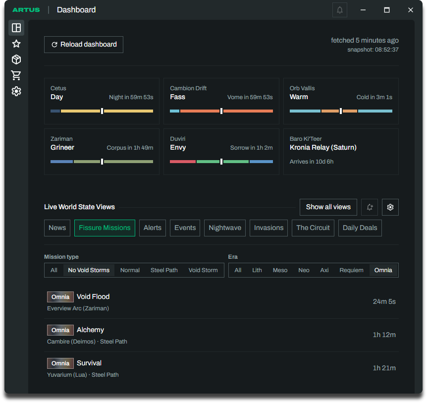
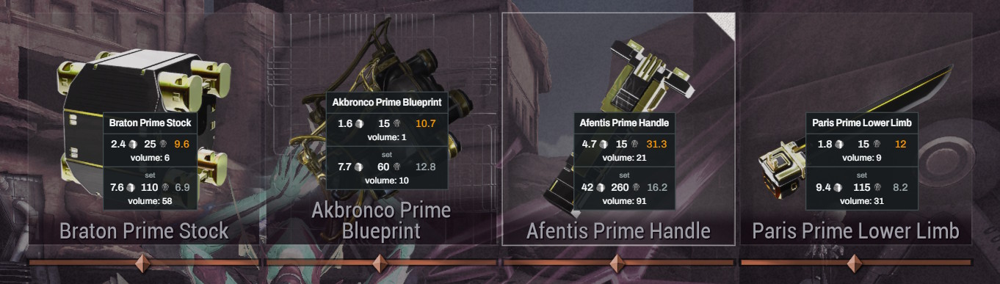

# Artus

> [!CAUTION]
> This project is in a very early alpha stage and is under heavy, active development. Expect bugs, crashes, or missing features.

<div align="center">
  
</div>

<div align="center">
  
</div>

Artus is a desktop companion app for the game Warframe, compatible with Windows and Linux (including Wayland). At its heart, it runs a sophisticated OCR (Optical Character Recognition) pipeline to read item names directly from your screen (e.g. your inventory or during the reward screen of Fissure missions) and enriches them with valuable market information like platinum prices and trading volume.

- [Artus](#artus)
  - [Features](#features)
  - [Download](#download)
  - [Disclaimers](#disclaimers)
    - [Liability Disclaimer](#liability-disclaimer)
    - [Relic Reward Detection](#relic-reward-detection)
    - [AI Usage](#ai-usage)
  - [Building from Source](#building-from-source)
  - [Community \& Credits](#community--credits)

## Features

- Screen OCR: Capture relic rewards, inventory items, and mastery items with hotkeys; recognize item names and enrich them with market prices, trading volume, and ducat values.
- Game Overlay: Show recognized items in a transparent, clickthrough overlay with prices, volume, vault status, owned counts, and configurable sell or salvage hints. Optional Wayland layer-shell support is available on Linux.
- Automatic Relic Detection: Detect Fissure reward screens through Windows debug output or optional experimental visual detection, capture rewards, and hide the overlay when the screen closes.
- Live Dashboard: Browse world cycles, Fissures, Baro Ki'Teer, alerts, invasions, Sorties, Nightwave, and other world-state views; choose favorite views and refresh the data.
- Market: Search tradeable items, browse popular items and related set parts, and inspect item details, current buy and sell orders, and price and volume history from `warframe.market`.
- Inventory: Add items manually or by OCR, edit quantities, track platinum and ducat totals, and open items in the Market tab.
- Mastery: Track completed gear and components manually or by OCR, filter the catalog, and estimate mastery rank progress with an entry for other mastery XP.
- Notifications: Create world-state alerts and live market price rules; review notification history and optionally use desktop notifications and sounds.
- Settings: Configure capture hotkeys, OCR, overlay behavior, price thresholds, notifications, and game detection.
- System Tray: Hide the main window to the tray and reopen, restart, or quit Artus from its menu.
- Updates: Check for new releases and offer an in-app download and relaunch.

## Download

The latest version for Windows and Linux can be found here: https://github.com/thaumictom/artus/releases/latest

> [!WARNING]
> Windows will flag the app as "potentially harmful" since it's not signed with a valid certificate. This is a common issue for small developers and can be bypassed by clicking "More info" and then "Run anyway". The app does not contain any harmful code, but if you are concerned, you can build it from source yourself.

Releases are compiled automatically by Github Actions on every push to the main branch. See [build-tauri.yml](.github/workflows/build-tauri.yml) for details on the build process.

## Disclaimers

### Liability Disclaimer

This tool runs independently of Warframe by default and does not inject code or modify any game files. While it is designed to be safe, it is provided "as-is" and used at your own risk.

Read more: https://support.warframe.com/hc/en-us/articles/360030014351-Third-Party-Software-and-You

### Relic Reward Detection

OCR can be triggered manually with a hotkey. Automatic relic reward detection can use Warframe's Windows debug output or an optional experimental visual detector on Windows and Linux. It does not read or modify EE.log or other game files, and it does not attach to the game process.

The code for this feature can be read here: [src-tauri/src/relic_rewards.rs](src-tauri/src/relic_rewards.rs)

### AI Usage

While I have a lot of experience in development (especially on the frontend), AI was used extensively to help write and make the Rust backend possible.

## Building from Source

While most users will just download the pre-packaged application, developers or enthusiasts can build the project from source on Windows and Linux.

**Prerequisites:**

- [Node.js](https://nodejs.org/) or compatible runtime & [pnpm](https://pnpm.io/) or compatible package manager
- [Visual Studio Build Tools](https://visualstudio.microsoft.com/visual-cpp-build-tools/) (Windows only)
- [Rust](https://rustup.rs/)

**Instructions:**

1. Clone the project to your computer.
2. Open a terminal (PowerShell or Bash) in the project folder and install the frontend dependencies:
   ```bash
   pnpm install
   ```
3. Run the development server (which will start both SvelteKit and the Tauri Rust backend):
   ```bash
   pnpm tauri dev
   ```
4. To build the final application for your system:
   ```bash
   pnpm tauri build
   ```

**Linux Note (Wayland):**
If you are on Linux and using Wayland, there is an optional Wayland layer-shell build available. Install system package `gtk-layer-shell` (must provide `gtk-layer-shell-0.pc` for `pkg-config`). You can run it with:

```bash
pnpm tauri dev --features wayland-layer-shell
```

## Community & Credits

If Artus is not the app for you, consider using these awesome tools:

- https://wfinfo.warframestat.us/
- https://alecaframe.com/

Without these contributions to Warframe, this app wouldn't be possible:

- https://github.com/WFCD/WFInfo
- https://github.com/WFCD/warframe-items/
- https://browse.wf/
- https://warframe.market/
- https://tenno.tools/
